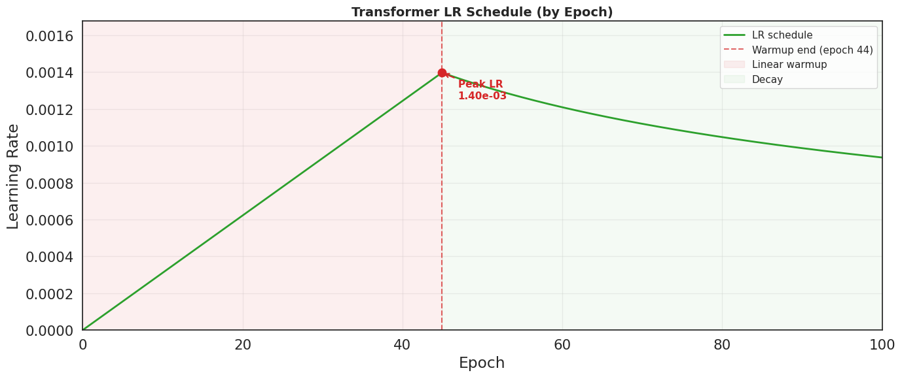
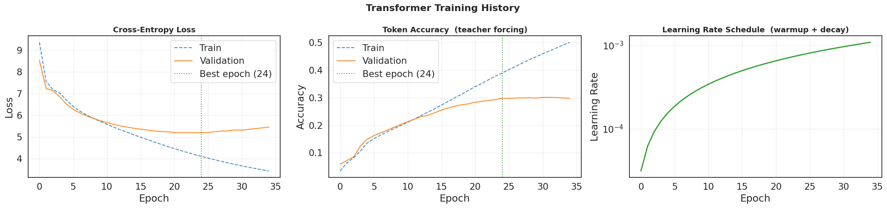
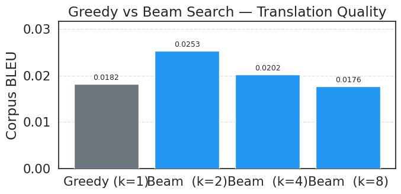
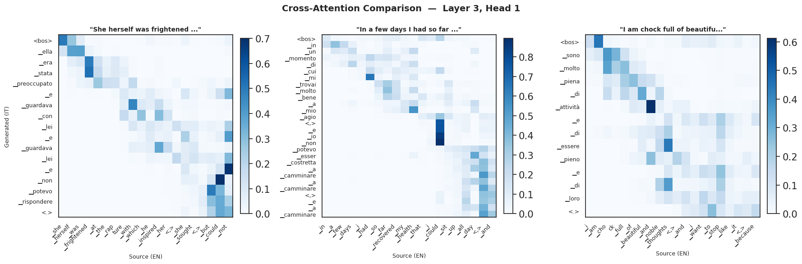
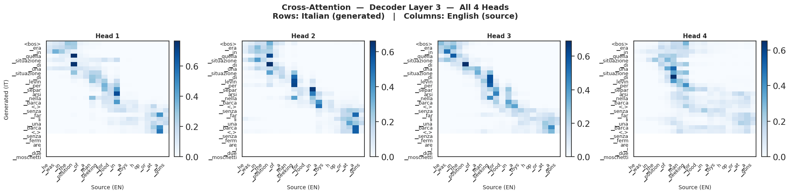

# Transformer NMT — English → Italian

A **from-scratch** PyTorch implementation of the encoder-decoder Transformer ([Vaswani et al., 2017](https://arxiv.org/abs/1706.03762)) trained for neural machine translation from English to Italian.

---

## Highlights

- Full Transformer (multi-head attention, sinusoidal PE, Pre-LN) built from scratch in PyTorch — no `transformers` library
- Shared BPE tokenisation (SentencePiece, 15 k vocab) across both languages
- Paper-exact training setup: Adam β₂=0.98, warmup + inverse-√ LR schedule, label smoothing
- Mixed-precision training (FP16) via `torch.amp` for ~1.5–2× speedup on GPU
- **Beam search** decoding with length normalisation vs greedy baseline
- Corpus BLEU evaluation with greedy ↔ beam comparison

---

## Dataset

| Property | Value |
|---|---|
| Name | [`opus_books`](https://huggingface.co/datasets/opus_books) |
| Language pair | English → Italian |
| Source | [OPUS](https://opus.nlpl.eu/) — Open Parallel Corpus |
| Total pairs | ~32 k sentence pairs |
| Split | 70% train / 15% val / 15% test |

`opus_books` is a parallel corpus derived from copyright-free books. It is publicly available via HuggingFace Datasets and loads with a single line — no manual downloads required.

```python
from datasets import load_dataset
dataset = load_dataset("opus_books", "en-it", split="train")
```

Sentences are tokenised with a **shared BPE model** (SentencePiece) trained on the combined EN+IT training corpus. Using a shared vocabulary means cognates and named entities share the same token ID across both languages.

---

## Model Architecture

Encoder-decoder Transformer with Pre-Layer Normalisation throughout.

| Component | Value |
|---|---|
| Encoder depth | 3 blocks |
| Decoder depth | 3 blocks |
| Embedding dim (*d_model*) | 128 |
| FFN hidden dim | 512 (4× *d_model*) |
| Attention heads | 4 |
| Dropout | 0.1 |
| Shared BPE vocabulary | 15 000 tokens |
| Max source length | 20 BPE tokens |
| Max target length | 22 BPE tokens |

---

## Hyperparameters

### Training

| Parameter | Value | Notes |
|---|---|---|
| Batch size | 256 | |
| Max epochs | 100 | with early stopping |
| Early stopping patience | 10 epochs | restores best weights |
| Gradient clipping | max norm = 1.0 | |

### Loss

| Parameter | Value | Notes |
|---|---|---|
| Loss function | CrossEntropyLoss | |
| Label smoothing (ε) | 0.1 | penalises overconfident outputs |
| Padding ignored | yes (`ignore_index=PAD_IDX`) | |

### Optimiser

| Parameter | Value |
|---|---|
| Optimiser | Adam |
| β₁ | 0.9 |
| β₂ | 0.98 |
| ε | 1×10⁻⁹ |

### Learning Rate Schedule

Paper-exact warmup + inverse square root decay:

$$\text{LR} = d_{\text{model}}^{-0.5} \cdot \min\!\left(\text{step}^{-0.5},\ \text{step} \cdot \text{warmup\_steps}^{-1.5}\right)$$

| Parameter | Value |
|---|---|
| Warmup steps | 4 000 |
| Peak LR | ~8.8×10⁻⁴ |



---

## Results

### Training Curves



### Greedy vs Beam Search (Corpus BLEU)

Beam search explores *k* partial hypotheses in parallel and scores completed sequences with length normalisation (α = 0.6), consistently outperforming greedy argmax decoding.



| Decoding | Corpus BLEU |
|---|---|
| Greedy (k=1) | 0.0182 |
| Beam (k=2) | 0.0253 |
| Beam (k=4) | 0.0202 |
| Beam (k=8) | 0.0176 |

---

## Analysis

### Attention Visualisation

Cross-attention weights reveal the alignment the model learns between source and target tokens. Monotonic diagonal patterns are typical for closely related language pairs like EN–IT.

**Cross-attention across 3 sentences (Layer 3, Head 1)** — shows the model generalises the same alignment strategy across different sentence structures.



**All 4 heads in the last decoder layer** — each head learns a slightly different alignment pattern, collectively covering the full source context.



---

## Repository Structure

```
transformer-nmt-en-it/
├── Translation_NN.ipynb   # Main notebook (run end-to-end in Colab)
├── assets/                # Training plots and attention visualisations
└── README.md
```

---

## Getting Started

Open the notebook in Google Colab (recommended — free GPU):

1. Upload `Translation_NN.ipynb` to Colab or clone the repo
2. Run all cells in order (`Runtime → Run all`)
3. Training takes ~30–60 min on a T4 GPU

All dependencies are installed automatically in the Setup cell.

---

## Reference

Vaswani, A., Shazeer, N., Parmar, N., Uszkoreit, J., Jones, L., Gomez, A. N., Kaiser, Ł., & Polosukhin, I. (2017).
**Attention Is All You Need.** *Advances in Neural Information Processing Systems*, 30.
[https://arxiv.org/abs/1706.03762](https://arxiv.org/abs/1706.03762)
